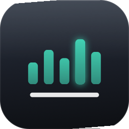
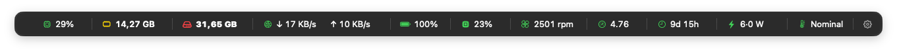

<p align="center">
  
</p>

<h1 align="center">QuickStatsPanel</h1>

<p align="center"><b>Press a key. Glance at your Mac's vitals. Get back to work.</b></p>

<p align="center">
  
  
  
</p>

---

QuickStatsPanel is a hotkey-summoned HUD for live Mac stats. No Dock icon, no
menu-bar item, no dashboard window cluttering your day — press **⌃⌥⌘Q** and a
thin strip appears near your cursor with everything at a glance. Press it
again (or Esc, or click anywhere else) and it's gone.

It's for people who want *iStat at a glance*: quick, shallow, dismissible —
not another monitoring suite that lives in your face all day.

<!-- Screenshot slot: drop a capture of the summoned strip at
     03_Screenshots/strip.png and restore this section.
## Screenshot


-->


## What it shows

| Tile | Reading |
|------|---------|
| **CPU** | Total usage %, user/system split, top processes |
| **Memory** | Used / total / pressure, top processes |
| **Disk** | Free space, capacity, live read/write throughput |
| **Network** | Download **and** upload, live, right in the strip |
| **Battery** | Charge, state, time remaining *(portables only)* |
| **GPU** | Utilization + device name |
| **Fans** | Live rpm per fan with min–max range *(hidden on fanless Macs)* |
| **Power** | Live CPU·GPU watts, plus ANE/DRAM/total detail *(Apple silicon)* |
| **Temperature** | Thermal pressure badge + per-sensor °C detail *(SoC/SSD/Battery)* |
| **Load Avg** | 1/5/15-minute load vs. core count |
| **Uptime** | Time since boot |

Click any tile for a detail card. Tiles for hardware your Mac doesn't have
simply don't appear. Every stat can be toggled and reordered in Settings.

## Why it's different

- **Zero permissions.** No Accessibility prompt, no root helper, no kernel
  extension, no full-disk access. Every reading comes from public or
  un-entitled system interfaces — install it and it just works.
- **Zero presence.** Nothing in your Dock, nothing in your menu bar. The app
  exists only in the moment you summon it.
- **Zero jitter.** Tiles reserve their worst-case width, so the strip never
  wobbles as numbers tick.
- **Private by design.** No network calls, no analytics, no accounts, no data
  collection of any kind. Your stats never leave the machine.

## Install

1. Download `QuickStatsPanel-1.0.0.dmg`.
2. Open it and drag **QuickStatsPanel** to **Applications**.
3. Launch it, then press **⌃⌥⌘Q** whenever you want your stats.

The app is code-signed and notarized by Apple — no Gatekeeper hoops.

**Requirements:** macOS 15 (Sequoia) or later. The Power and Temperature
tiles need Apple silicon; on other Macs they step aside gracefully.

## Keyboard & mouse

| Action | Shortcut |
|--------|----------|
| Summon / dismiss the strip | **⌃⌥⌘Q** *(rebindable)* |
| Dismiss | **Esc** or click anywhere outside |
| Keep on screen (pin) | **⌃⌥⌘P** *(rebindable)* |
| Settings | **⌘,** or the gear in the strip |
| Move the strip | drag its background *(fixed anchors remember the spot)* |
| More options | right-click the strip |

Tip: tools like BetterMouse can map a spare mouse button to the hotkey —
one thumb click to see your stats.

## Settings

Stats (toggle/reorder) · Appearance (4 theme presets + custom colors) ·
Panel (position, size, refresh rate) · Hotkeys (rebind summon/pin) ·
Launch at login.

## Build from source

```bash
git clone https://github.com/Xpycode/QuickStatsPanel
cd QuickStatsPanel/01_Project
xcodegen generate
xcodebuild -scheme QuickStatsPanel -destination 'platform=macOS' build
```

Requires Xcode 16+ and [xcodegen](https://github.com/yonaskolb/XcodeGen).

---

<p align="center">© 2026 Luces Umbrarum · <a href="https://apps.lucesumbrarum.com">apps.lucesumbrarum.com</a></p>
